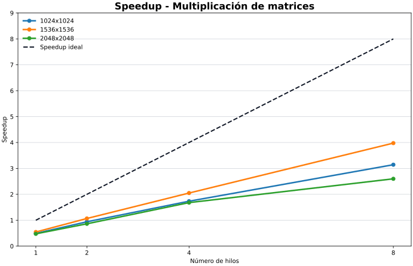
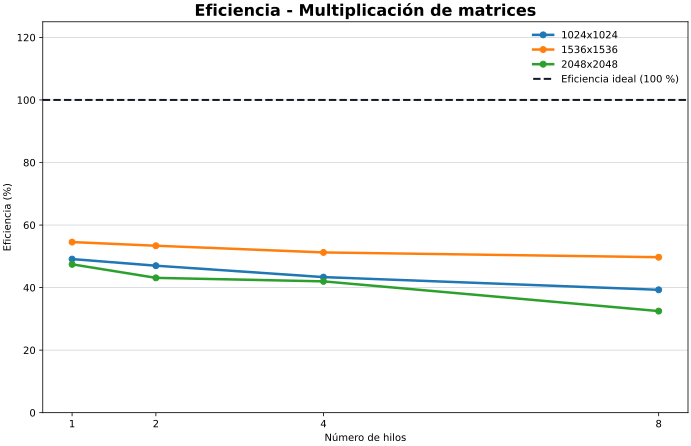
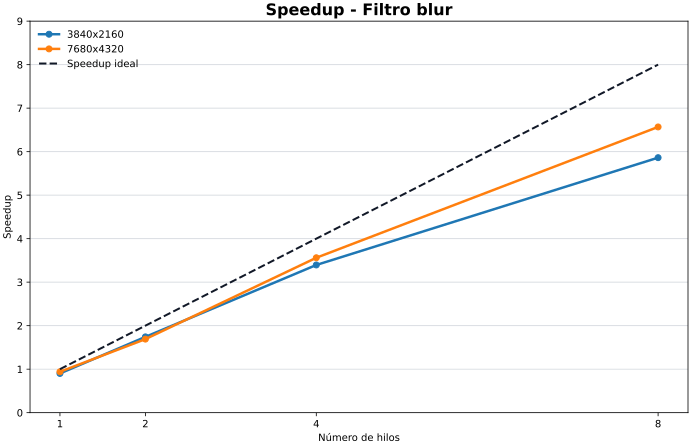
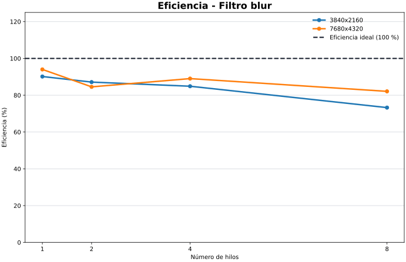

# Resultados y métricas

## Metodología de medición

Las pruebas se ejecutaron en el equipo de Jorge Luis Felipe Aguilar Portillo (carné 23195): MacBook Pro Mac16,8 con Apple M4 Pro, 14 núcleos físicos (10 de rendimiento y 4 de eficiencia), 24 GB de memoria y macOS 26.6.2 arm64. Los cuatro programas se compilaron con Apple Clang 21.0.0, Homebrew libomp 22.1.8 y las opciones `-O2 -Xpreprocessor -fopenmp`.

Se replicó la metodología de los otros integrantes para conservar la comparabilidad: una corrida de calentamiento y 5 corridas medidas por configuración, matrices de 1024, 1536 y 2048, blur en 3840x2160 y 7680x4320, bloque de 32x32 y 1, 2, 4 y 8 hilos. Aunque el equipo tiene 14 núcleos, no se agregó una configuración de 14 hilos porque no forma parte del conjunto común de pruebas.

Los tiempos corresponden únicamente a la región de cálculo. No incluyen reserva de memoria, generación de datos ni checksum. Las entradas fueron deterministas y todos los checksums secuenciales y paralelos coincidieron.

```text
Speedup(p) = Ts / Tp
Eficiencia(p) = Speedup(p) / p
Eficiencia (%) = Eficiencia(p) x 100
```

## Multiplicación de matrices

### Tamaño 1024x1024

| Hilos | Tiempo promedio (s) | Speedup | Eficiencia (%) |
|---:|---:|---:|---:|
| Secuencial | 0.061629 | 1.000 | 100.00 |
| 1 | 0.125482 | 0.491 | 49.11 |
| 2 | 0.065564 | 0.940 | 47.00 |
| 4 | 0.035539 | 1.734 | 43.35 |
| 8 | 0.019609 | 3.143 | 39.29 |

### Tamaño 1536x1536

| Hilos | Tiempo promedio (s) | Speedup | Eficiencia (%) |
|---:|---:|---:|---:|
| Secuencial | 0.217278 | 1.000 | 100.00 |
| 1 | 0.398335 | 0.545 | 54.55 |
| 2 | 0.203536 | 1.068 | 53.38 |
| 4 | 0.106010 | 2.050 | 51.24 |
| 8 | 0.054639 | 3.977 | 49.71 |

### Tamaño 2048x2048

| Hilos | Tiempo promedio (s) | Speedup | Eficiencia (%) |
|---:|---:|---:|---:|
| Secuencial | 0.516057 | 1.000 | 100.00 |
| 1 | 1.088072 | 0.474 | 47.43 |
| 2 | 0.598604 | 0.862 | 43.11 |
| 4 | 0.307280 | 1.679 | 41.99 |
| 8 | 0.198587 | 2.599 | 32.48 |

### Interpretación

- La configuración de 8 hilos obtuvo el menor tiempo paralelo en los tres tamaños. El mejor speedup fue 3.977 para 1536x1536.
- OpenMP con 1 hilo fue entre 1.83 y 2.11 veces más lento que el ciclo secuencial. Esto no mide solo el overhead de crear hilos: la implementación paralela usa un recorrido por bloques distinto al recorrido `i-k-j` secuencial.
- En 2048x2048, 2 hilos todavía fueron más lentos que la versión secuencial; la mejora apareció a partir de 4 hilos.
- La eficiencia con 8 hilos varió entre 32.48 % y 49.71 %. La pérdida respecto al escalamiento ideal es consistente con el costo adicional del algoritmo por bloques y con límites de caché y memoria.
- La configuración 2048x2048 con 8 hilos tuvo la mayor dispersión (desviación estándar de 0.022542 s), por lo que su promedio debe interpretarse con más cautela que las otras configuraciones.

## Filtro blur

### Tamaño 3840x2160

| Hilos | Tiempo promedio (s) | Speedup | Eficiencia (%) |
|---:|---:|---:|---:|
| Secuencial | 0.018703 | 1.000 | 100.00 |
| 1 | 0.020746 | 0.902 | 90.16 |
| 2 | 0.010733 | 1.743 | 87.13 |
| 4 | 0.005509 | 3.395 | 84.88 |
| 8 | 0.003191 | 5.862 | 73.27 |

### Tamaño 7680x4320

| Hilos | Tiempo promedio (s) | Speedup | Eficiencia (%) |
|---:|---:|---:|---:|
| Secuencial | 0.074775 | 1.000 | 100.00 |
| 1 | 0.079533 | 0.940 | 94.02 |
| 2 | 0.044220 | 1.691 | 84.55 |
| 4 | 0.020997 | 3.561 | 89.03 |
| 8 | 0.011385 | 6.568 | 82.10 |

### Interpretación

- El blur escaló de forma clara en ambos tamaños. Con 8 hilos, 4K alcanzó un speedup de 5.862 y 8K uno de 6.568.
- El caso 8K conservó 82.10 % de eficiencia con 8 hilos, el mejor resultado de escalamiento del benchmark.
- OpenMP con 1 hilo fue ligeramente más lento que la versión secuencial (entre 6 % y 10 %), resultado compatible con el overhead del runtime en una región de cálculo corta.
- El reparto estático por filas mantiene un trabajo uniforme y no requiere sincronización durante el filtro. La eficiencia decrece con más hilos, pero menos que en matrices.

## Conclusión individual

En este Apple M4 Pro, el filtro blur fue el candidato más favorable para paralelización: redujo el promedio de 0.074775 s a 0.011385 s en 8K con 8 hilos. La multiplicación también mejoró con 4 y 8 hilos, pero su implementación OpenMP por bloques necesita suficiente paralelismo para compensar el mayor costo frente al recorrido secuencial. Estos resultados no deben atribuirse únicamente al procesador: también difieren de los resultados Windows por el compilador, el runtime OpenMP y el sistema operativo.

## Archivos de respaldo

- `benchmark_raw.csv`: 125 mediciones individuales y sus checksums.
- `benchmark_summary.csv`: promedio, mediana, mínimo, máximo y desviación estándar de cada configuración.
- `benchmark_summary.md`: resumen del equipo y tabla compacta de métricas.
- `evidencia_corridas.txt`: compilación y salidas representativas.
- `graficas/`: curvas de speedup y eficiencia para ambos problemas.

## Gráficas

### Multiplicación de matrices





### Filtro blur




