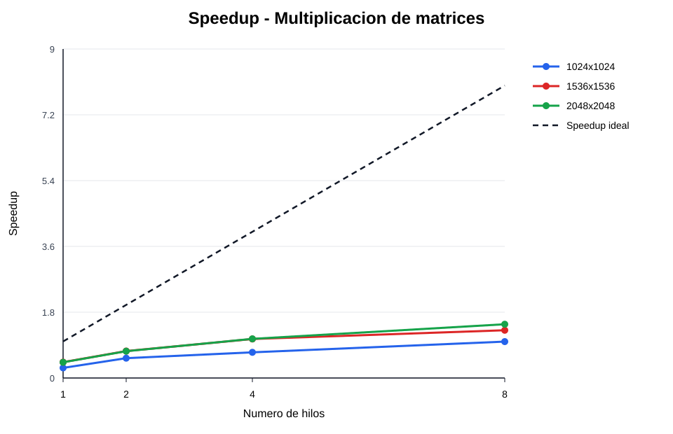
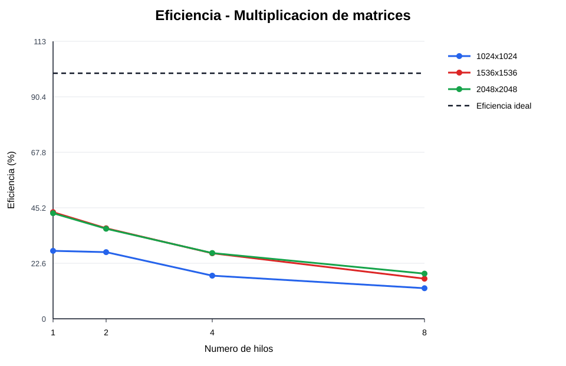
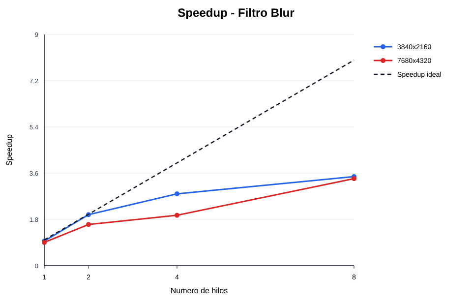
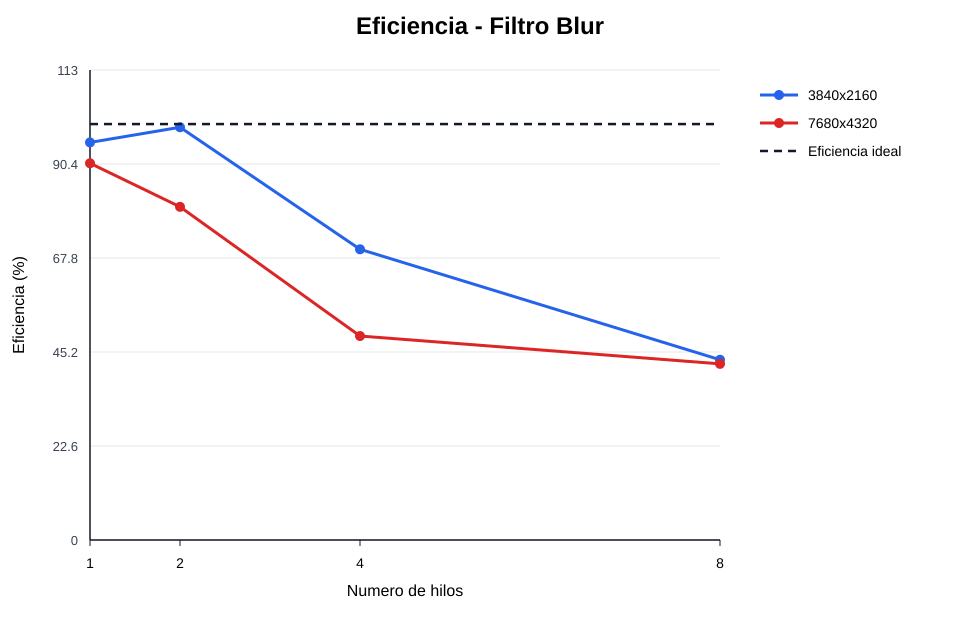

# Resultados y Metricas

## Metodologia de medicion

Para cada configuracion se realizaron 5 corridas medidas. Antes de esas corridas se ejecuto una corrida de calentamiento, que no se incluyo en las estadisticas. Los tiempos usados corresponden a la region de calculo del algoritmo: multiplicacion de matrices o aplicacion del filtro blur.

El promedio de las 5 corridas se uso para calcular las metricas. El speedup compara cada configuracion paralela contra la version secuencial real del mismo problema y tamano, no contra OpenMP con 1 hilo. La eficiencia relaciona ese speedup con la cantidad de hilos usados.

```text
Speedup(p) = Ts / Tp
Eficiencia(p) = Speedup(p) / p
Eficiencia (%) = Eficiencia(p) x 100
```

## Multiplicacion de matrices

### Tamano 1024x1024

| Hilos | Tiempo promedio (s) | Speedup | Eficiencia (%) |
|---:|---:|---:|---:|
| Secuencial | 0.231200 | 1.000 | 100.00 |
| 1 | 0.835600 | 0.277 | 27.67 |
| 2 | 0.426000 | 0.543 | 27.14 |
| 4 | 0.329200 | 0.702 | 17.56 |
| 8 | 0.232200 | 0.996 | 12.45 |

### Tamano 1536x1536

| Hilos | Tiempo promedio (s) | Speedup | Eficiencia (%) |
|---:|---:|---:|---:|
| Secuencial | 1.248000 | 1.000 | 100.00 |
| 1 | 2.874000 | 0.434 | 43.42 |
| 2 | 1.692600 | 0.737 | 36.87 |
| 4 | 1.169600 | 1.067 | 26.68 |
| 8 | 0.955400 | 1.306 | 16.33 |

### Tamano 2048x2048

| Hilos | Tiempo promedio (s) | Speedup | Eficiencia (%) |
|---:|---:|---:|---:|
| Secuencial | 3.379600 | 1.000 | 100.00 |
| 1 | 7.860600 | 0.430 | 42.99 |
| 2 | 4.608200 | 0.733 | 36.67 |
| 4 | 3.155400 | 1.071 | 26.78 |
| 8 | 2.297800 | 1.471 | 18.38 |

### Observaciones descriptivas

- En 1024x1024, el menor tiempo paralelo fue con 8 hilos: 0.232200 s.
- En 1024x1024, el mayor speedup fue 0.996 con 8 hilos, con eficiencia de 12.45 %.
- En 1024x1024, al pasar de 4 a 8 hilos el tiempo promedio disminuyo de 0.329200 s a 0.232200 s.
- En 1024x1024, OpenMP con 1 hilo tuvo un tiempo mayor que la version secuencial: 0.835600 s frente a 0.231200 s.
- En 1536x1536, el menor tiempo paralelo fue con 8 hilos: 0.955400 s.
- En 1536x1536, el mayor speedup fue 1.306 con 8 hilos, con eficiencia de 16.33 %.
- En 1536x1536, al pasar de 4 a 8 hilos el tiempo promedio disminuyo de 1.169600 s a 0.955400 s.
- En 1536x1536, OpenMP con 1 hilo tuvo un tiempo mayor que la version secuencial: 2.874000 s frente a 1.248000 s.
- En 2048x2048, el menor tiempo paralelo fue con 8 hilos: 2.297800 s.
- En 2048x2048, el mayor speedup fue 1.471 con 8 hilos, con eficiencia de 18.38 %.
- En 2048x2048, al pasar de 4 a 8 hilos el tiempo promedio disminuyo de 3.155400 s a 2.297800 s.
- En 2048x2048, OpenMP con 1 hilo tuvo un tiempo mayor que la version secuencial: 7.860600 s frente a 3.379600 s.

## Filtro Blur

### Tamano 3840x2160

| Hilos | Tiempo promedio (s) | Speedup | Eficiencia (%) |
|---:|---:|---:|---:|
| Secuencial | 0.052000 | 1.000 | 100.00 |
| 1 | 0.054400 | 0.956 | 95.59 |
| 2 | 0.026200 | 1.985 | 99.24 |
| 4 | 0.018600 | 2.796 | 69.89 |
| 8 | 0.015000 | 3.467 | 43.33 |

### Tamano 7680x4320

| Hilos | Tiempo promedio (s) | Speedup | Eficiencia (%) |
|---:|---:|---:|---:|
| Secuencial | 0.153800 | 1.000 | 100.00 |
| 1 | 0.169800 | 0.906 | 90.58 |
| 2 | 0.096000 | 1.602 | 80.10 |
| 4 | 0.078400 | 1.962 | 49.04 |
| 8 | 0.045400 | 3.388 | 42.35 |

### Observaciones descriptivas

- En 3840x2160, el menor tiempo paralelo fue con 8 hilos: 0.015000 s.
- En 3840x2160, el mayor speedup fue 3.467 con 8 hilos, con eficiencia de 43.33 %.
- En 3840x2160, al pasar de 4 a 8 hilos el tiempo promedio disminuyo de 0.018600 s a 0.015000 s.
- En 3840x2160, OpenMP con 1 hilo tuvo un tiempo mayor que la version secuencial: 0.054400 s frente a 0.052000 s.
- En 7680x4320, el menor tiempo paralelo fue con 8 hilos: 0.045400 s.
- En 7680x4320, el mayor speedup fue 3.388 con 8 hilos, con eficiencia de 42.35 %.
- En 7680x4320, al pasar de 4 a 8 hilos el tiempo promedio disminuyo de 0.078400 s a 0.045400 s.
- En 7680x4320, OpenMP con 1 hilo tuvo un tiempo mayor que la version secuencial: 0.169800 s frente a 0.153800 s.

## Graficas

### Multiplicacion de matrices





### Filtro Blur




